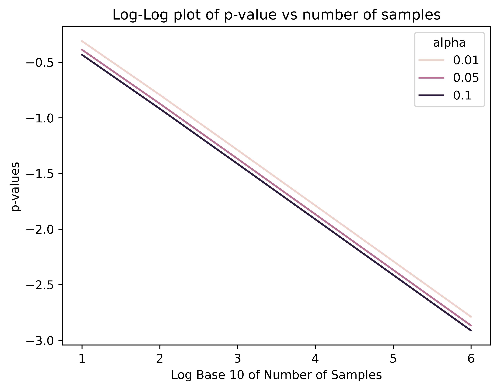
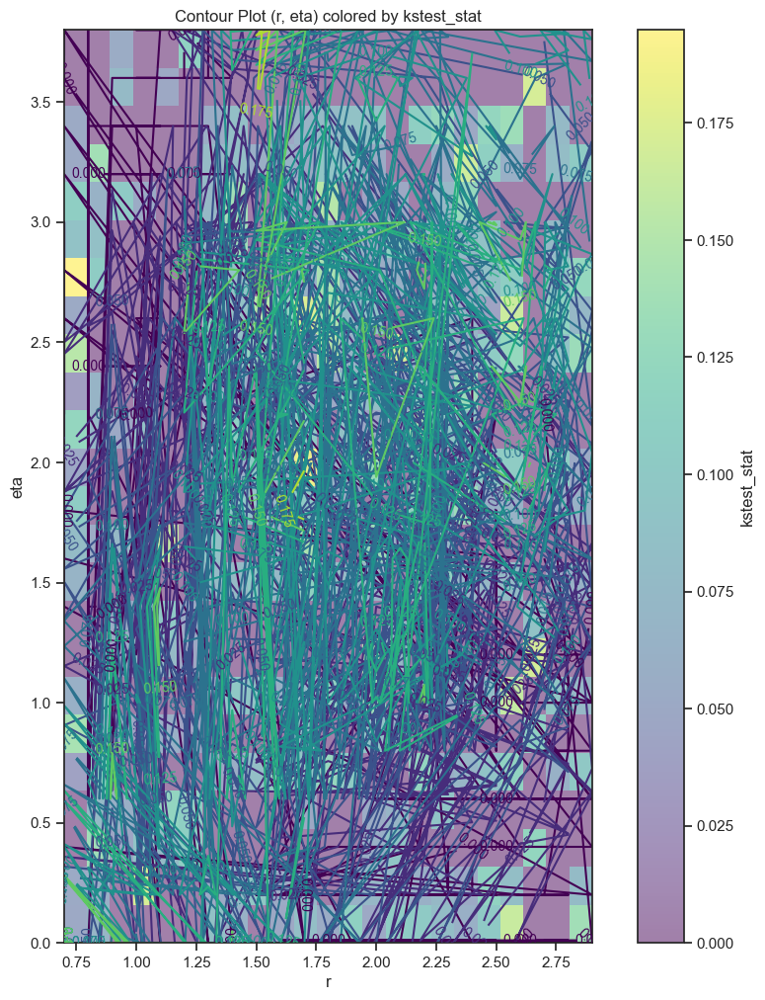

# Testing Framework (Semester Summary)

## Things done:
- Explored how KS-test interacts with prior model (recall graph with )
- Refined process of generating CDFs (slightly ongoing with Brandon), both in terms of actual code but also organization
- Explored how number of samples vary with p-value
- Created fairly comprehensive library for plotting things (with working contour plots)
- Experimented with different optimization schemes to find best parameters in the context of the KS-test

## Exciting plots:

## Things to be done:
- Fix the p-value and find the number of samples for which the ks-test statistic go to threshold.
- Try different validation methods for smaller numbers of samples
- Clean up the file structure
- Check how matlab cdfs and scipy cdfs compare for small r
- Philosophical discussion on the insights we hope to get from conducting the hypothesis test - if it rejects the null always due to model misspecification or requires 10 digit precision, does that really mean the prior model is not realistic?
- Consider alternative more efficient way of generating CDFs using weights for x, theta together

## Other Notes
At large, the pipeline is:
1. Clean data and have images stored in folder
2. Run `convert_to_wavelet_basis` to create a dictionary which maps a layer number to a dataframe corresponding to all the data
3. Do a big grid search across r = 0.1 to 5, eta = 0 to 10?
4. Do a finer grid